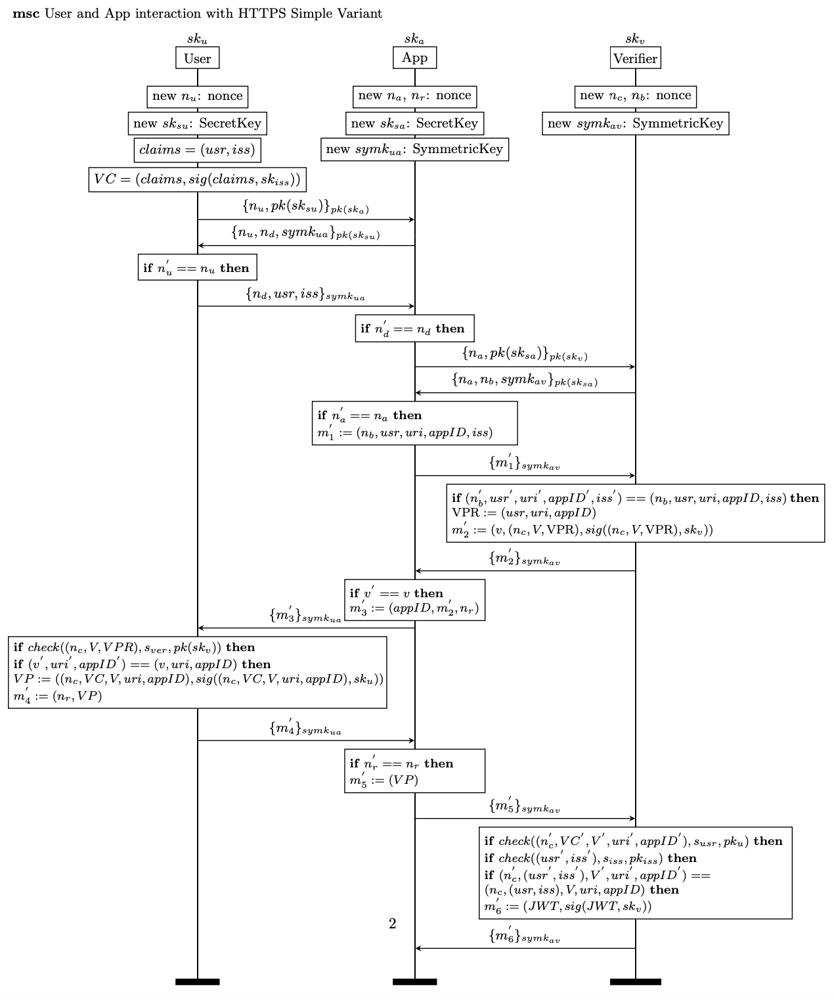
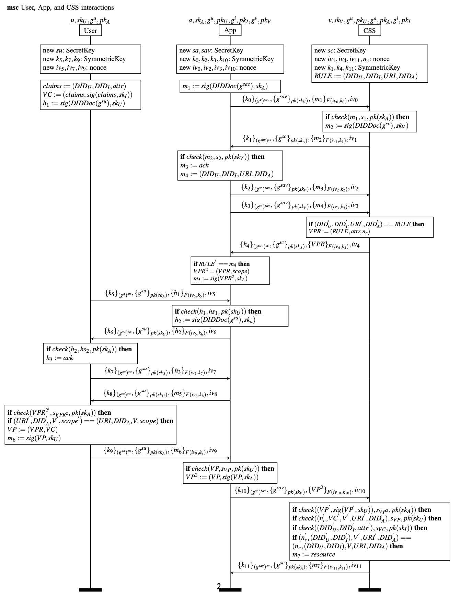

## VC-Based Solid Authentication Protocol with separation between Apps and Users

The VC-Based Solid Authentication Protocol with separation between Apps and User: The issuance of the VC is done following traditional SSI protocol where users directly contact issuer for asking new credentials. The verification is slightly different since we put an application in the authentication loop in order to "delegate" the access. 
It is possible to implement the protocol through two different approaches which differs on the basis of security used. In the first proposal we used HTTPS, while in the second one we leveraged DIDComm. We present both in the following sections.
### HTTPS
This version consider HTTPS handshake referring to the nonce as $n_u, n_a$, the others nonces are used to guarantee protection against MITM attacks. 
It is possible to check the output of our protocol [here](log/log.txt)

#### Result

| Property  | Holds | Note |
| ------------- | ------------- | ------------- |
| Secret rule_fromVerifier | Yes  | The Verifiable Presentation Request sent from the Verifier remains secret, cannot be produced if the user is not the real user. |
| Secret vp_fromProver | Yes  | The Verifiable Presentation sent by the Prover (User) remains secret. |
| Secret access_token_fromVerifier | Yes  | The token given to the App to access resources remains secret. |
| Authentication Verifier  | Yes  | The app is able to authenticate the verifier. |
| Authentication App  | Yes  | The verifier is able to authenticate the app. |
| Authentication User  | Yes  | The app is able to authenticate the user. |
### DIDComm
The greatest difference with respect to HTTPS is that in this version we do not use encryption of the entire packet since we leverage the in-line encryption of the protocol presented in [[https://identity.foundation/didcomm-messaging/spec/ | DIDComm Spec v.2 ]]. In particular, the content of the message is encrypted using XChaCha20Poly1305 with a 256 bit key (XC20P), which guarantee anonymity and encryption; while the symmetric key is wrapped according to ECDH-ES+A256KW. The information about the symmetric key used ($k_i$) for the encryption are contained in the first part of the message, while $iv_i$ is sent in plaintext.
To authenticate the party and to establish a session key, the session public key to be used to encrypt the new messages is encrypted using the long-live public key of the other party (CSS), as shown in the message $\{g^{sav}\}_{pk(sk_v)}$. Similarly, the other party (CSS) encrypt the session public key using the long-live public key of the App.

